# Longitudinal Modeling of Sleep Timing, Duration, and Social Jetlag Across the Adult Lifespan Using High-Resolution Wearable Data

All of Us Research Program Fitbit sleep phenotyping

Mason Manetta; Angus Burns; Shea Andrews; Yue Leng; Diego Mazzotti

Presenter: Diego R. Mazzotti, Ph.D. (on behalf of Mason Manetta)

42,290 participants | 22.4M filtered nights | 530 mean nights / participant

Support: All of Us Research Program, Office of the Director, NIH

# Disclosure Information

To review this speaker's disclosure information, please visit:

sleepmeeting.org

# SLEEP 2026 Photography Policy

- Photography is permitted during this lecture unless a no-photography icon is shown.
- Photographs are allowed for personal, social, or non-commercial use.
- Attendees may not use flash photography or otherwise distract presenters or attendees.

# Wearables and Longitudinal Monitoring of Sleep and Circadian Traits

## Why this matters

- Sleep is important to health and chronic disease risk.
- Most large epidemiologic studies rely on self-report or short-term monitoring.
- Wearables create scalable, repeated measurements of sleep timing, duration, and variability.

Longitudinal Fitbit data move sleep phenotyping from sparse recall to repeated behavioral measurement.

## Published context

Prior All of Us Fitbit analyses have linked wearable-derived sleep measures to clinical phenotypes, motivating higher-resolution longitudinal modeling of sleep behavior.

| Core output | Definition |
|---|---|
| Onset | sleep start time |
| Offset | wake time |
| Midpoint | center of sleep episode |
| Duration | sleep window / time asleep |

# Sources of Variability

## Extrinsic

- Weekdays vs. weekends / free days
- Seasonality and holidays
- Environmental exposures: photoperiod, temperature, humidity, daylight saving time

## Intrinsic and social

- Age and sex
- Employment status and social scheduling constraints
- Stable participant-level differences captured by repeated measures

These factors are established individually, but longitudinal wearable data allow them to be modeled together within the same participants.

# Study Aim

Characterize demographic and environmental contributors to longitudinal variability in sleep patterns using device-measured Fitbit sleep data from the All of Us Research Program.

Onset: sleep start | Midpoint: sleep timing | Duration: sleep amount

# All of Us Research Program and Fitbit Sleep

::: {.columns}
::: {.column width="45%"}
## All of Us

- National longitudinal cohort with EHR, survey, genomic, and wearable data.
- Participant-level covariates include demographics, employment, BMI, ZIP3 geography, and socioeconomic context.

## Fitbit measurements

- Sleep daily summaries provide nightly sleep duration.
- Sleep-level records provide high-resolution onset/offset information.
- Repeated nights allow within-person modeling over age, season, and social schedule.
:::
::: {.column width="55%"}
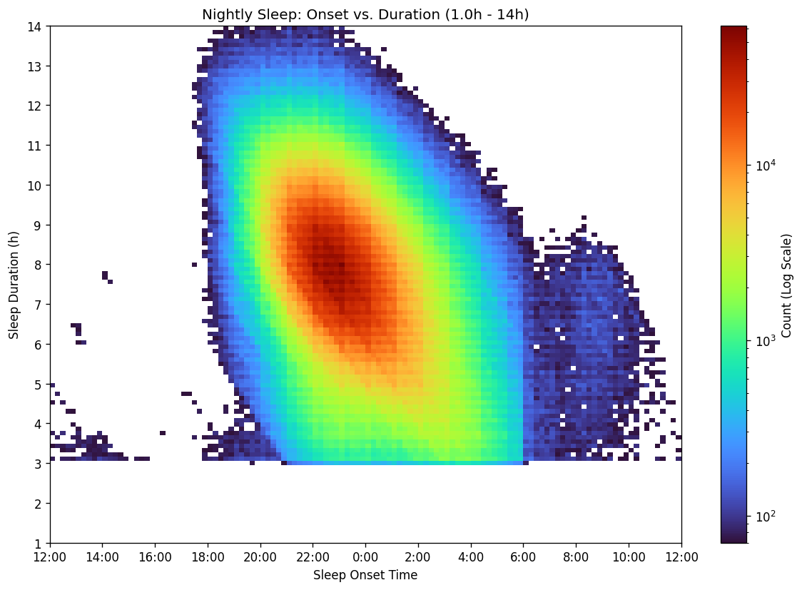{width=5.7in}

Filtered person-night onset and duration density.
:::
:::

# Participant Characteristics

::: {.columns}
::: {.column width="42%"}
| Characteristic | Value |
|---|---:|
| Included participants | 42,290 |
| Filtered sleep nights | 22,428,610 |
| Age | 52 +/- 17 y |
| Female | 67.4% |
| Male | 32.3% |
| Nights recorded | 530 +/- 730 |
| Nightly duration | 447 +/- 65 min |
| Nightly duration | 7.5 +/- 1.1 h |

AoU participants with Fitbit sleep -> valid primary sleep episodes -> 42,290 participants with 22.4M filtered nights
:::
::: {.column width="58%"}
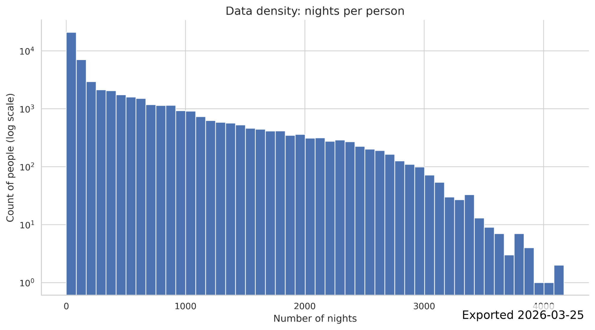{width=6.0in}

Distribution of nights per participant.
:::
:::

# From Fitbit Records to Nightly Sleep Episodes

::: {.columns}
::: {.column width="45%"}
## Filtering and episode construction

- Sleep-level records linked to daily summaries.
- Non-primary sleep excluded.
- Implausible raw durations excluded: >18h, zero/negative, common sensor artifact values.
- Segments clustered into nightly episodes; largest main sleep cluster retained per logical night.
- Sleep date assigned using a 6-hour backward shift.
:::
::: {.column width="55%"}
{width=5.7in}

Onset-duration density after filtering shows expected overnight sleep structure.
:::
:::

# Modeling Strategy

::: {.columns}
::: {.column width="55%"}
## Linear mixed-effects models

Yij ~ poly(ageij, 2) + weekendij x employmenti + sexi + monthij + (1 | personi)

- Outcomes: onset, offset, midpoint, duration.
- Person random intercept controls stable between-person differences.
- Quadratic age captures non-linear lifespan trends.
- Employment-by-weekend interaction estimates social constraint/social jetlag patterns.
:::
::: {.column width="45%"}
## Time handling

- Timing variables were linearized because distributions were primarily unimodal.
- Clock times before noon shifted forward by 24h.
- Example: 1:00 AM -> 25.0; 11:00 PM -> 23.0.

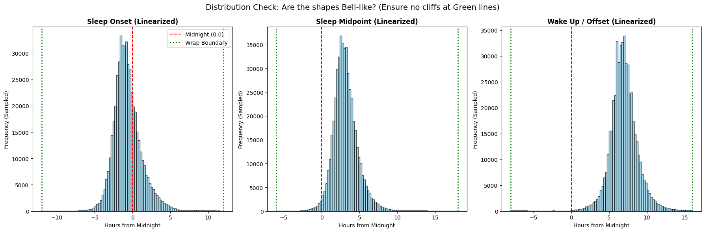{width=4.4in}
:::
:::

# Sleep and Circadian Traits x Age and Sex

::: {.columns}
::: {.column width="35%"}
- Age showed a quadratic association with sleep timing across the adult lifespan.
- Model-estimated sleep midpoint advanced by approximately 42 minutes from age 18 to age 57.
- Midpoint: 2:37 AM at age 18 vs. 1:54 AM at age 57.

A simple linear age term would miss the lifespan shape of sleep timing.
:::
::: {.column width="65%"}
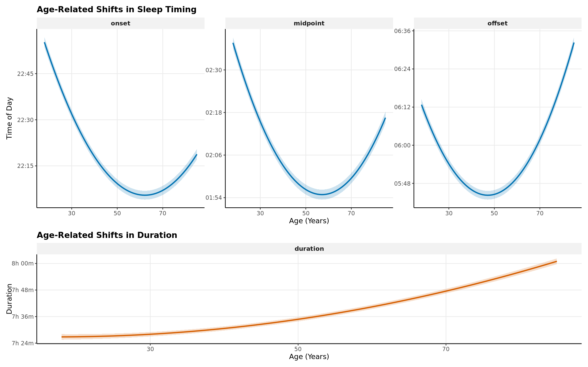{width=6.6in}
:::
:::

# Sleep Duration Across the Adult Lifespan

::: {.columns}
::: {.column width="38%"}
- Duration increased with age in adjusted models.
- Estimated gain: >34 minutes between ages 18 and 85.
- Age 18: 7.45h; age 85: 8.02h.

## Why it matters

Timing and duration change together, so future analyses should consider mutually adjusted timing-duration phenotypes.
:::
::: {.column width="62%"}
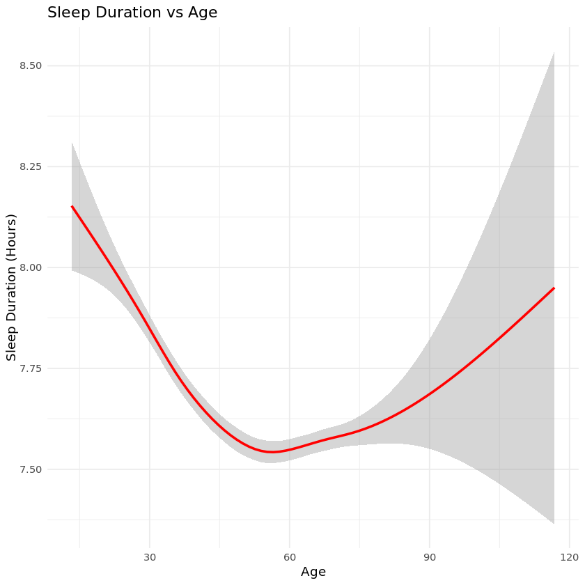{width=6.3in}
:::
:::

# Sleep and Circadian Traits x Other Sociodemographics

::: {.columns}
::: {.column width="38%"}
- Weekend status delayed midpoint, onset, and offset across employment groups.
- Participants employed for wages showed the largest midpoint delay.
- Employed for wages: weekday midpoint 3:26 AM vs. weekend midpoint 4:08 AM.
- Weekend sleep duration extended by approximately 28 minutes.

Social timing constraints are visible in wearable sleep at population scale.
:::
::: {.column width="62%"}
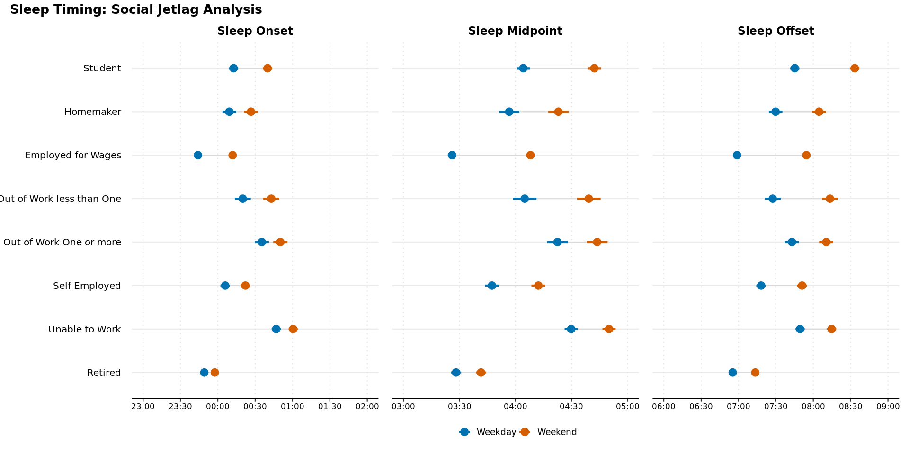{width=6.3in}
:::
:::

# Sleep and Circadian Traits x Environmental Variables

::: {.columns}
::: {.column width="46%"}
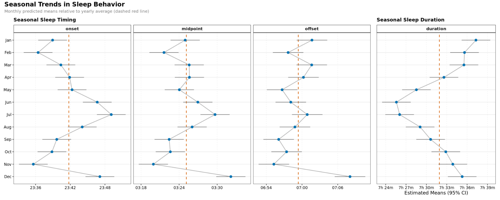{width=4.7in}
:::
::: {.column width="54%"}
- Month terms indicated seasonal differences in sleep behavior.
- Sleep duration was approximately 11 minutes lower in June than the January maximum.
- Unadjusted weekly trends suggest non-sinusoidal structure, likely mixing photoperiod, calendar behavior, holidays, and DST.

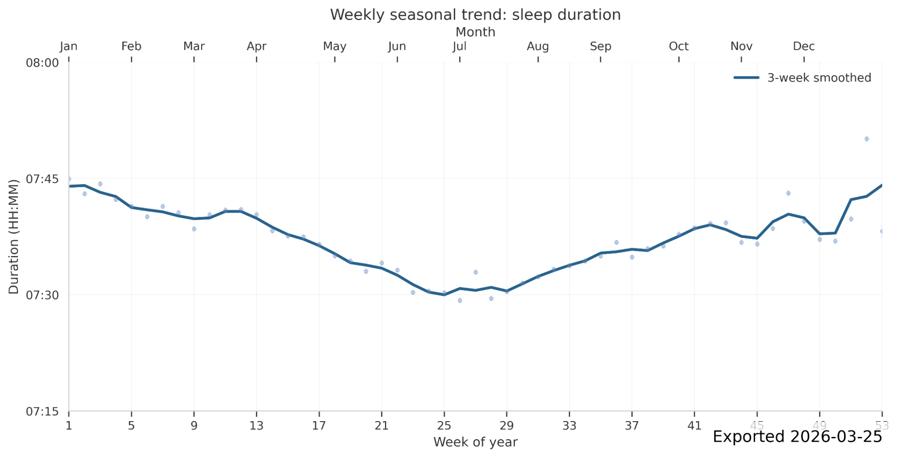{width=5.2in}
:::
:::

# What This Adds

## Population-level characterization

- Quantifies non-linear age effects in device-measured sleep.
- Separates workday/free-day structure from participant-level baselines.
- Provides adjusted estimates across employment categories.

## Foundation for next-stage analyses

- Genetic studies of sleep timing and chronotype.
- Clinical risk stratification using longitudinal sleep phenotypes.
- Environmental extensions: photoperiod, temperature, humidity, DST.

Large-scale wearable data can turn sleep timing from a sparse self-report phenotype into a longitudinal, model-ready exposure.

# Limitations and Interpretation Guardrails

## Measurement

- Fitbit-derived sleep depends on device classification of main sleep.
- Shift work is not directly measured; employment status is a proxy for social schedule constraints.
- Linearization works for the observed distribution but may under-represent true night-shift phenotypes.

## Cohort and covariates

- AoU Fitbit participants are not a probability sample of U.S. adults.
- Pregnancy episode exclusion was not feasible in the V8 data context.
- ZIP3 geography is coarse for environmental and DST classification.

# Conclusions and Future Directions

1. Sleep timing and duration are dynamically structured by non-linear age effects.
2. Employment and weekend status reveal strong social timing constraints, including measurable social jetlag.
3. Seasonal patterns persist at population scale and motivate environmental modeling.

Longitudinal wearable sleep data provide a scalable foundation for personalized circadian epidemiology.

# Acknowledgements

## University of California, San Francisco

- Mason Manetta
- Yue Leng, Ph.D.
- Shea Andrews, Ph.D.

## Harvard Medical School / Brigham and Women's Hospital

- Angus Burns, Ph.D.

## University of Kansas Medical Center

- Diego R. Mazzotti, Ph.D.

## Funding and support

- All of Us Research Scholars Program
- RTI International All of Us Researcher Academy
- National Institutes of Health, Office of the Director

Questions and discussion

# Backup: Validation Against Published AoU Sleep Structure

Reference comparison with published All of Us Fitbit sleep structure; used during extraction validation.

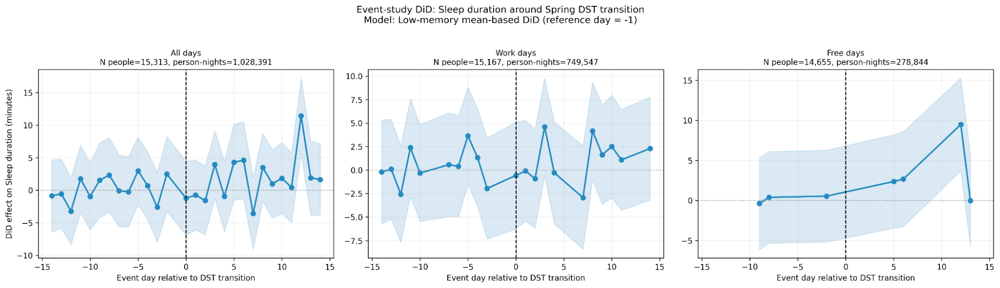{width=7.7in}

# Backup: Geographic and Environmental Extensions

::: {.columns}
::: {.column width="52%"}
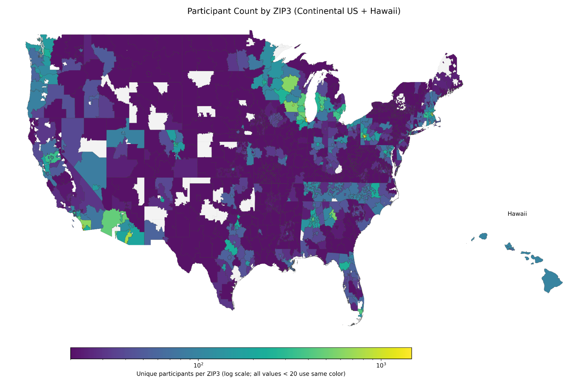{width=5.3in}

Participant counts by ZIP3.
:::
::: {.column width="48%"}
- ZIP3 enables coarse geography for SES, DST, photoperiod, and PRISM weather linkage.
- Future models can estimate temperature, vapor pressure deficit, precipitation, and photoperiod effects.
- Environmental analyses should account for ZIP3 population weighting and non-random participant geography.
:::
:::

# Backup: Daylight Saving Time Design

::: {.columns}
::: {.column width="50%"}
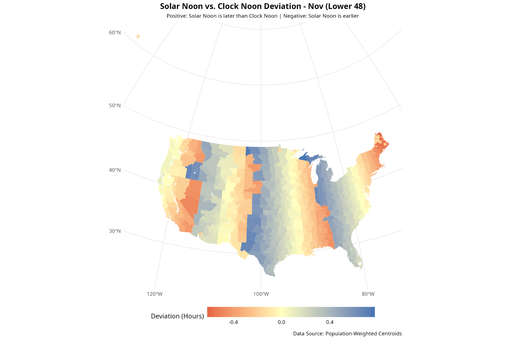{width=5.1in}
:::
::: {.column width="50%"}
## DST contrast

- Classify ZIP3 as DST-observing vs. non-DST control.
- Center each person-year using pre-transition baseline days -14 to -7.
- Estimate event-day differences around spring/fall transitions.

{width=4.8in}
:::
:::
